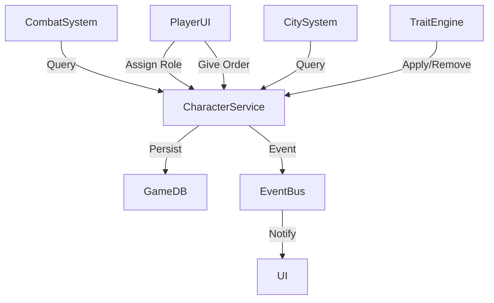

# Characters System

## Overview

Characters are central to the game: they can lead armies, govern cities, join councils, and gain traits from actions. Characters provide bonuses and have agendas that influence faction behaviour. This plan defines the data model, system responsibilities, and testable requirements for implementing the Characters System.

## Table of contents

- [Characters System](#characters-system)
  - [Overview](#overview)
  - [Table of contents](#table-of-contents)
  - [Definition of terms](#definition-of-terms)
  - [Feature status](#feature-status)
  - [Architectural considerations and constraints](#architectural-considerations-and-constraints)
  - [Implementation guide](#implementation-guide)
    - [Feature requirements](#feature-requirements)
    - [Implementation steps](#implementation-steps)
  - [Phases](#phases)
    - [Phase 1 — Data modeling](#phase-1--data-modeling)
      - [Objective](#objective)
      - [Technical details](#technical-details)
      - [Phase requirements](#phase-requirements)
      - [Examples](#examples)
    - [Phase 2 — Systems](#phase-2--systems)
      - [Objective](#objective-1)
      - [Technical details](#technical-details-1)
      - [Phase requirements](#phase-requirements-1)
      - [Examples](#examples-1)
    - [Phase 3 — Integration](#phase-3--integration)
      - [Objective](#objective-2)
      - [Technical details](#technical-details-2)
      - [Phase requirements](#phase-requirements-2)
  - [Acceptance criteria](#acceptance-criteria)
  - [Testing](#testing)
  - [See also](#see-also)
  - [References](#references)

## Definition of terms

| Term   | Meaning                                                                                                           | Reference |
| ------ | ----------------------------------------------------------------------------------------------------------------- | --------- |
| Agenda | A character-driven set of priorities and goals that influence faction behaviour and decision heuristics.          |           |
| Role   | A binding assignment for a character that grants system effects (e.g., `general`, `governor`, `council-member`).  |           |
| Trait  | A persistent modifier gained or lost through actions/events that affects character capabilities and calculations. |           |

## Feature status

Not started

> Allowed statuses: Not started, In discovery, In design, In development, In test, In review, Completed, Abandoned, Blocked — update this field to the current status for tracking.

## Architectural considerations and constraints

- Data model: `Character` records contain stable identity, roles (at most one role per role-type), a set of traits, stats, and agenda metadata. Persisted in the primary game DB with change events for replay/rollback.
- Performance: Trait lookup and application must be O(1) average for hot-path actions; avoid linear scans of trait lists during combat resolution. Aim for <2ms additional latency per action on mid-tier hardware.
- Concurrency: Multiple subsystems (combat, city simulation) may read/update characters; use optimistic concurrency for short-lived updates and authoritative saves at tick boundaries.
- Storage: Traits should be represented as compact IDs with serialized parameters to reduce memory and bandwidth usage during network sync.

Mermaid overview (high-level components):



## Implementation guide

### Feature requirements

- (***not-started***) Characters must be able to occupy roles (general, governor, council member).
  - GIVEN a character exists in the game state
  - WHEN a player or system assigns the character to a role
  - THEN the character's role is stored, and role effects are applied to relevant calculations (combat, city bonuses) immediately and persisted to the DB

- (***not-started***) Characters gain and lose traits via actions and events.
  - GIVEN an action or event that provides a trait change (e.g., `win_battle`, `commit_crime`)
  - WHEN the event is processed by the TraitEngine
  - THEN the trait is added or removed atomically, with a persisted record and an emitted change event for other systems to react to

- (***not-started***) Traits and roles influence calculations deterministically.
  - GIVEN a calculation (combat, governance bonuses) that references character modifiers
  - WHEN the calculation runs
  - THEN trait and role modifiers are included and produce reproducible results given the same inputs and game seed

### Implementation steps

1. Define the `Character` schema (ID, stats, role assignments, trait-set, agenda metadata).
2. Implement `TraitEngine` with atomic apply/remove operations and event emission.
3. Implement `CharacterService` read/write API with optimistic concurrency and persistence hooks.
4. Add role-effect calculators for combat and city systems.
5. Expose a minimal UI surface for role assignment and trait inspection.

## Phases

### Phase 1 — Data modeling

***not-started***

This phase is documented in detail in [data-model.md](characters/data-model.md), which covers the complete schema definition, serialization strategy, and validation approach.

#### Objective

Establish the canonical `Character` schema, role model, trait representation, and persistence format.

#### Technical details

- `Character` contains: `Guid Id`, `string Name`, `Dictionary<string,int> Stats`, `Dictionary<RoleType, RoleAssignment> Roles`, `HashSet<TraitId> Traits`, `Agenda AgendaMeta`.
- Traits are stored as ID + parameter blob to allow parameterized effects.

#### Phase requirements

Detailed requirements for data modeling are specified in [data-model.md](characters/data-model.md). Persistence strategy is covered in [persistence.md](characters/persistence.md).

- (***not-started***) Schema created and validated in unit tests
  - GIVEN a new Character instance constructed in code
  - WHEN the instance is serialized and deserialized
  - THEN the resulting instance equals the original

> See [data-model.md](characters/data-model.md) for detailed schema requirements

#### Examples

```csharp
// docs/examples/Character.cs
// Character model example

/// <summary>
/// Canonical, minimal character model used in unit tests and early integration.
/// </summary>
public record Character(Guid Id, string Name)
{
  /// <summary>Mapping of stat name to integer value.</summary>
  public Dictionary<string,int> Stats { get; init; } = new();
  /// <summary>Assigned trait ids.</summary>
  public HashSet<string> Traits { get; init; } = new();
}
```

### Phase 2 — Systems

***not-started***

This phase encompasses multiple child features:

- [trait-engine.md](characters/trait-engine.md) — Atomic trait application and removal with event emission
- [role-system.md](characters/role-system.md) — Role assignments and effect calculators
- [events.md](characters/events.md) — Character lifecycle and change events

#### Objective

Implement the `TraitEngine`, role-effect calculators, and integration points for combat and city systems.

#### Technical details

- `TraitEngine.ApplyTrait(CharacterId, TraitId, params)` performs validation, persists the change, and emits a `TraitChanged` event.
- Role effects are pure functions mapping current `Character` + `Context` -> `ModifierSet`.

#### Phase requirements

Trait application is detailed in [trait-engine.md](characters/trait-engine.md). Role effects are specified in [role-system.md](characters/role-system.md). Event emission and consumption are covered in [events.md](characters/events.md).

- (***not-started***) TraitEngine applies and removes traits atomically
  - GIVEN a trait application request
  - WHEN the engine processes the request
  - THEN the trait is present (or absent) on the character and an event is emitted

> See [trait-engine.md](characters/trait-engine.md) for detailed trait engine requirements

#### Examples

```csharp
// docs/examples/TraitEngine.cs
/// <summary>
/// Minimal trait application API used by systems in integration tests.
/// </summary>
public interface ITraitEngine
{
  bool ApplyTrait(Guid characterId, string traitId);
  bool RemoveTrait(Guid characterId, string traitId);
}
```

### Phase 3 — Integration

***not-started***

This phase brings together multiple child features:

- [integration.md](characters/integration.md) — Cross-system integration with factions, armies, and cities
- [ui.md](characters/ui.md) — User interface for character management and inspection
- [persistence.md](characters/persistence.md) — End-to-end save/load with migration support
- [modding.md](characters/modding.md) — Extensibility points for custom traits and roles

#### Objective

Connect characters to factions, armies and city systems; provide UI surfaces and persistence end-to-end.

#### Technical details

- Integrate `CharacterService` with `CombatSystem` and `CitySystem` via `ICharacterReader` interface.
- Provide migration scripts for existing character-like data.

#### Phase requirements

Integration requirements are detailed in [integration.md](characters/integration.md). UI requirements are in [ui.md](characters/ui.md). Persistence and migration requirements are in [persistence.md](characters/persistence.md).

- (***not-started***) End-to-end scenario: assign role, apply trait, resolve combat bonus
  - GIVEN a character assigned as `general` with a `battle-hardened` trait
  - WHEN the character leads an army into combat
  - THEN combat resolution observes role and trait modifiers and the outcome matches expected deterministic values in tests

> See [integration.md](characters/integration.md) for detailed integration requirements

## Acceptance criteria

- Characters can be assigned roles and role effects are applied within the relevant systems and persisted.
- Trait application and removal are atomic and emit change events consumed by other systems.
- Unit tests cover schema serialization, trait apply/remove, and role-effect calculations with >= 90% branch coverage for core logic.

## Testing

Detailed testing strategy and requirements are documented in [testing.md](characters/testing.md). Performance benchmarks and targets are specified in [performance.md](characters/performance.md).

- **Unit tests**: Validate `Character` schema round-trip, `TraitEngine` behavior, role-effect pure functions.
- **Integration tests**: Simulate an end-to-end scenario where a role assignment + trait application affect combat outcome deterministically.
- **Performance tests**: Measure action + trait application latency; target <2ms additional per action on mid-tier hardware.

## See also

**Related system plans:**

- [Mapping System](mapping.md)
- [Factions System](factions.md)
- [Resources System](resources.md)
- [Onboarding System](onboarding.md)

**Child plans:**

- [Data Model][data-model] — Schema definition and serialization
- [Trait Engine][trait-engine] — Atomic trait application and event emission
- [Role System][role-system] — Role assignments and effect calculators
- [Integration][integration] — Cross-system integration points
- [Persistence][persistence] — Save/load and migration strategy
- [Events][events] — Character lifecycle and change events
- [UI][ui] — User interface for character management
- [Testing][testing] — Unit, integration, and performance tests
- [Performance][performance] — Optimization targets and benchmarks
- [Modding][modding] — Extensibility for custom traits and roles

[data-model]: characters/data-model.md
[trait-engine]: characters/trait-engine.md
[role-system]: characters/role-system.md
[integration]: characters/integration.md
[persistence]: characters/persistence.md
[events]: characters/events.md
[ui]: characters/ui.md
[testing]: characters/testing.md
[performance]: characters/performance.md
[modding]: characters/modding.md

## References

- Game design notes: internal design doc (TBD)
- Trait systems research: (link placeholder)
