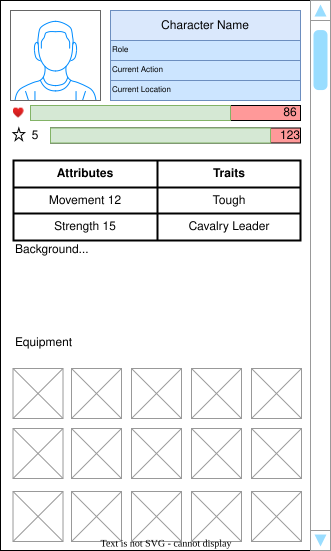

# Characters — UI Surfaces

## Overview

UI surfaces for viewing characters, assigning roles, and inspecting traits.

This covers the following UI elements:

- Character icon
- Character list
- Assigning characters to command an army or navy or units within an army or navy,
  govern cities or other settlements, or sit in council positions

## Table of contents

- [Characters — UI Surfaces](#characters--ui-surfaces)
  - [Overview](#overview)
  - [Table of contents](#table-of-contents)
  - [Feature status](#feature-status)
  - [Implementation guide](#implementation-guide)
    - [Feature requirements](#feature-requirements)
      - [Character list](#character-list)
      - [Character tooltip](#character-tooltip)
      - [Character properties](#character-properties)
      - [Assigning a character to a role](#assigning-a-character-to-a-role)
    - [Implementation steps](#implementation-steps)
  - [Examples](#examples)

## Feature status

Not started

## Implementation guide

### Feature requirements

#### Character list

- (***not-started***) Player can open the character list.
  - GIVEN a session on the main game view
  - WHEN the player clicks on the faction icon and then clicks the **characters** tab
  - THEN the **character list** is displayed, filtered to their faction

- (***not-started***) Player can search for characters on the **character list**.
  - GIVEN a session with the **character list** visible
  - WHEN enter **search criteria**
  - THEN the list is filtered according to the **search criteria**

#### Character tooltip

- (***not-started***) Player can see the character tooltip.
  - GIVEN a session with any view where a character icon is displayed
    - Army or navy properties where the character is assigned as a commander
    - City properties where the character is assigned as a governor
    - Council view where the character is assigned to a council position
    - Character list
  - WHEN the player hovers over the character icon
  - THEN the **character tooltip** is displayed, showing relevant properties
    - Name
    - Titles
    - Stats
      - Health
      - ...
    - Traits
    - Abilities
    - Equipment

#### Character properties

#### Assigning a character to a role

- (***not-started***) Role assignment to **army or navy commander**.
  - GIVEN a player has an **army or navy** selected and has the **character list** open
  - WHEN the player drags a **character** to the **army or navy command slot** in the **army or navy properties**
  - THEN the **character** is assigned as commander of that army or navy

- (***not-started***) Role assignment to **unit commander**.
  - GIVEN a player has an **army or navy** selected and has the **character list** open
  - WHEN the player drags a **character** to the a **unit** in the **army or navy properties**
  - THEN the **character** is assigned as commander of that unit

- (***not-started***) Role assignment to **city governor**.
  - GIVEN a player has an **city (or other settlement)** selected and has the **character list** open
  - WHEN the player drags a **character** to the **city governor slot** in the **city properties**
  - THEN the **character** is assigned as governor of that city

- (***not-started***) Role assignment to **faction council**.
  - GIVEN a player has an **council view** open and has the **character list** open
  - WHEN the player drags a **character** to a **council member slot** in the **council view**
  - THEN the **character** is assigned as that council member

### Implementation steps

1. Design wire-frames and accessibility checklist.
2. Implement minimal react/uwp/XAML surfaces as appropriate.

## Examples

HTML/preview notes: include character card with trait list and assign button.
