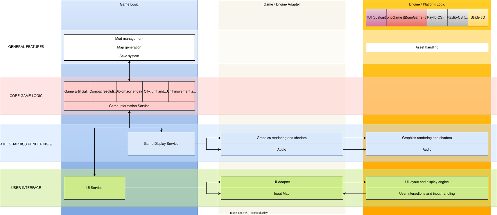

# Engine Decoupling

## Overview

It is desirable to separate game-specific logic from engine-specific logic. Doing this allows the game development to prototype while engine features are still in development, render in modes compatible with AI development and automated testing, and change engines without redeveloping the entire game.

| Game-specific logic                                                          | Engine-specific logic                                        |
|------------------------------------------------------------------------------|--------------------------------------------------------------|
| User interface layout (e.g what information appears on a city or unit panel) | User interface components (e.g how buttons and sliders work) |
| Game artificial intelligence                                                 | Graphics rendering and shaders                               |
| Map generation                                                               | Input handling                                               |
| Diplomacy                                                                    | Asset pipeline                                               |
| Combat                                                                       | Audio handling                                               |
| Mod management                                                               |                                                              |

The downside is increased abstraction and associated performance cost.

## Diagram

The following diagram shows the intended coupling pattern: game features communicate with an adapter layer, which then binds to one or more engine implementations.

## Table of contents

- [Engine Decoupling](#engine-decoupling)
  - [Overview](#overview)
  - [Diagram](#diagram)
  - [Table of contents](#table-of-contents)
    - [Phase 1 — Interface development](#phase-1--interface-development)
    - [Phase 2 — Headless adapter development](#phase-2--headless-adapter-development)
      - [Objective](#objective)
      - [Technical details](#technical-details)
      - [Phase requirements](#phase-requirements)
    - [Phase 3 — TUI adapter development](#phase-3--tui-adapter-development)
      - [Objective](#objective-1)
      - [Constraints](#constraints)
      - [Technical details](#technical-details-1)
      - [Phase requirements](#phase-requirements-1)
    - [Phase 4 — Monogame adapter development](#phase-4--monogame-adapter-development)
      - [Objective](#objective-2)
      - [Technical details](#technical-details-2)
      - [Phase requirements](#phase-requirements-2)
    - [Phase 5 — Raylib adapter development](#phase-5--raylib-adapter-development)
      - [Objective](#objective-3)
      - [Technical details](#technical-details-3)
      - [Phase requirements](#phase-requirements-3)
    - [Phase 6 — Stride3D adapter development](#phase-6--stride3d-adapter-development)
      - [Objective](#objective-4)
      - [Technical details](#technical-details-4)
      - [Phase requirements](#phase-requirements-4)
    - [Cross-cutting requirements (applies to all phases)](#cross-cutting-requirements-applies-to-all-phases)
  - [Acceptance criteria](#acceptance-criteria)
  - [Testing](#testing)
  - [Implementation considerations](#implementation-considerations)
  - [See also](#see-also)
  - [References](#references)

### Phase 1 — Interface development

Phase 1 defines the stable adapter contracts, DTO shapes and example APIs used by all adapters (rendering, input, audio and asset lifecycle). The full Phase 1 content — interface definitions, DTO examples, usage snippets and API guidance — is in the child document: [Phase 1 — Interface development](phase-1-interface-development.md).

### Phase 2 — Headless adapter development

#### Objective

- Provide a minimal, dependency-free adapter for CI, deterministic tests and server/headless runs.

#### Technical details

- Implement `HeadlessAdapter` that records render commands (no GPU), simulates input via scripted events, and implements `IAudioPlayer` as a no-op or a recorder.
- Ensure UI layout and hit-testing implementations are exercised without platform rendering.
- Provide deterministic execution modes (fixed timestep, seeded RNG) to support reproducible integration tests.

#### Phase requirements

- (***Not started***) Headless adapter passes integration scenarios for AI, combat and map generation.
  - GIVEN deterministic seeds and scenario scripts
  - WHEN CI runs integration suite
  - THEN results are stable and asserted by tests.

### Phase 3 — TUI adapter development

#### Objective

- Implement a terminal-based UI adapter that renders directly (no external engine) and provides a practical low-dependency UI for debugging, automation and low-graphics platforms.

#### Constraints

- TUI adapter renders directly to a terminal/console (ANSI/VT or platform console APIs) and must implement control rendering, sizing/positioning, colours and theming without relying on an existing graphics engine.

#### Technical details

- Implement rendering primitives for characters, colour blocks, and simple layout primitives; map `IRenderContext` UI primitives to terminal drawing operations.
- Implement input mapping from console keys to `IInputProvider` events, including mouse support where available.
- Implement a minimal layout engine for control sizing/positioning, theming and hit-testing suitable for tile/console rendering.
- For systems lacking complex text attributes, provide fallback rendering (monochrome, simplified layouts).

#### Phase requirements

- (***Not started***) TUI adapter supports UI rendering, interactions and input mapping for common screens (city panel, unit panel, map viewport).
  - GIVEN a set of UI screens and control definitions
  - WHEN run with TUI adapter
  - THEN UI layout, rendering and interactions behave acceptably for gameplay purposes.

### Phase 4 — Monogame adapter development

#### Objective

- Implement MonoGame adapters for 2D (and optional 3D) rendering, input and audio.

#### Technical details

- Implement `Monogame2DAdapter` mapping `IRenderContext` draw DTOs to sprite-batch calls, manage textures and simple materials.
- Provide shader/material integration where MonoGame supports custom effects; map shader descriptors from DTOs to engine-specific effect parameters.
- Implement audio via Monogame/NAudio bindings as required by platform.
- Ensure UI control rendering maps to sprite/text draw calls with correct layout, theming and input handling.

#### Phase requirements

- (***Not started***) Monogame2DAdapter implemented with basic UI screens and audio playback.
  - GIVEN the adapter is selected
  - WHEN running a small playtest scenario
  - THEN UI renders correctly and audio plays for sample assets.

### Phase 5 — Raylib adapter development

#### Objective

- Provide a Raylib-based adapter as an alternative lightweight graphical backend.

#### Technical details

- Implement `RaylibAdapter` mapping draw DTOs to raylib draw calls; implement shader support using raylib's shader APIs where available.
- Implement input, simple audio and UI mapping similarly to other adapters.
- Raylib adapter should prioritise simplicity and portability (single-binary deployments).

#### Phase requirements

- (***Not started***) Raylib adapter implements core 2D rendering, input and audio for representative scenes.

### Phase 6 — Stride3D adapter development

#### Objective

- Implement a Stride-based adapter to expose advanced 3D rendering, shading and pipeline features.

#### Technical details

- Implement `Stride3DAdapter` that maps 3D rendering DTOs, materials and shader descriptors to Stride's rendering pipeline.
- Expose advanced features (shader/material parameters, lighting, post-processing) via capability flags and extension points.
- Ensure UI layering for 3D viewports — support overlay UI rendered with orthographic projection or separate UI pass.

#### Phase requirements

- (***Not started***) Stride adapter renders 3D scenes and supports UI overlays, shader materials and audio playback for example scenes.

### Cross-cutting requirements (applies to all phases)

- Graphics: adapters must document shader/material mapping, supported texture formats and fallback behaviours when shaders are not supported.
- Audio: adapters must support basic playback, stop, volume, and asset referencing; document platform limitations.
- User interface: all adapters must implement control rendering (sizing/positioning, colours, theming) and UI interactions (hit-testing, focus, input routing). Provide a reference set of UI controls and examples.

## Acceptance criteria

- Game logic can be executed without the engine present (headless mode).

## Testing

- Unit tests
  - Interface contract unit tests (validate capability negotiation, lifecycle behaviour).
  - Adapter translator tests (DTO -> engine call mapping) using fakes.

- Integration tests
  - Headless scenario runs for AI, combat, and map generation with deterministic seeds.
  - End-to-end smoke tests that exercise adapter registration and engine selection.

- Performance tests
  - Microbenchmarks for hot-paths (simulation tick with adapter calls) to measure allocation and latency.
  - Frame-rate / throughput tests for Monogame/Stride adapters under representative workloads.

## Implementation considerations

- Readability: keep adapter contracts small and preference composition over inheritance. Provide XML docs for all interfaces.
- Reliability: adapters should validate inputs and fail fast with meaningful diagnostics; provide graceful fallbacks to Text/Headless when engines are unavailable.
- Testability: design contracts to be easily mockable; provide a `TestAdapter` for CI that records calls for assertions.
- Performance: minimize allocations crossing the adapter boundary; use structs and pooling for draw command collections.
- Versioning: define semantic versioning for adapter contract changes and provide shims for compatibility when evolving interfaces.

## See also

- `docs/plans/4x-game/technical/engine-decoupling/engine-decoupling.drawio.svg` — visual source exported from draw.io

## References

- Plan template: `docs/templates/plan-template.md`
