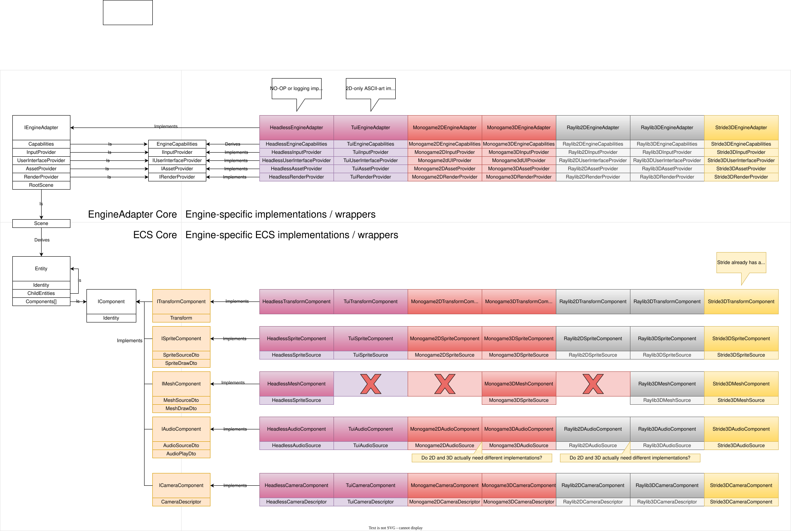

# Phase 1 — Interface development

## Overview

Phase 1 defines the stable adapter contracts and DTO shapes used by all adapters (rendering, input, audio, asset lifecycle). The goal is to produce small, well-documented C# interfaces and compact DTOs that minimize allocation and provide a stable surface for engine adapters.

## Table of contents

- [Phase 1 — Interface development](#phase-1--interface-development)
  - [Overview](#overview)
  - [Table of contents](#table-of-contents)
  - [Feature status](#feature-status)
  - [Definition of terms](#definition-of-terms)
  - [Architectural considerations and constraints](#architectural-considerations-and-constraints)
  - [Implementation guide](#implementation-guide)
    - [Feature requirements](#feature-requirements)
    - [Technical details](#technical-details)
    - [Phase requirements](#phase-requirements)
    - [API examples (minimal)](#api-examples-minimal)
    - [Class diagram](#class-diagram)
    - [DTO guidelines](#dto-guidelines)
    - [Testing and compatibility](#testing-and-compatibility)
    - [Performance targets](#performance-targets)
  - [See also](#see-also)
  - [References](#references)

## Feature status

Not started

## Definition of terms

| Term | Meaning | Reference |
| ---- | ------- | --------- |
| Adapter | An implementation binding the engine-agnostic contracts to a specific engine (MonoGame, Stride, Raylib, TUI, Headless). | |
| DTO | Data Transfer Object — compact, typically struct-based shapes passed across the adapter boundary. | |
| ContractVersion | Semantic version string indicating the adapter contract shape. | |

## Architectural considerations and constraints

- Separation boundary: define a small, stable surface area between simulation (game logic) and engine bindings (render/input/audio/asset pipeline).
- Capability negotiation: adapters must advertise capabilities (2D, 3D, text-only, audio) so game subsystems can enable/disable optional features at runtime.
- Performance: minimize allocations and data marshaling across the adapter boundary; use structs and pooling for draw command collections.
- Platform: some adapters require native platform binaries; provide configuration to select engines and fallbacks for CI/headless.

## Implementation guide

### Feature requirements

- (***Not started***) API definitions committed with XML docs and examples.
  - GIVEN interface PR is opened
  - WHEN team reviews and approves
  - THEN interfaces are versioned and published for adapter implementations.

### Technical details

- Define `IEngineAdapter` (lifecycle, capability descriptor, provider accessors such as `GetRenderProvider`, `GetInputProvider`).
- Define provider interfaces (`IRenderProvider`, `IInputProvider`, `IUserInterfaceProvider`, `IAssetProvider`) that expose minimal, adapter-owned runtime surfaces and DTO translation helpers.
- Providers are intentionally lightweight and adapter-owned: callers obtain a provider from the adapter and submit DTOs or poll events through that provider.
- Define `IAudioPlayer` (play/stop/volume, audio asset references) and `IAssetProvider`/`IAssetLoader` for asset lifecycle operations.
- Provide capability descriptor model (`EngineCapabilities`) returned at adapter init and allow specific engine capability variants (e.g. `HeadlessEngineCapabilities`) to derive from the base capabilities.

### Phase requirements

- (***Not started***) Adapter lifecycle & capability negotiation
  - GIVEN adapters are present at startup
  - WHEN the game queries capabilities
  - THEN `IEngineAdapter` returns `EngineCapabilities` and exposes `Initialize`/`Shutdown` semantics and diagnostics for mismatches.

### API examples (minimal)

```csharp
// Example adapter root interface
public interface IEngineAdapter : IDisposable
{
  EngineCapabilities Capabilities { get; }
  Task InitializeAsync(EngineConfig config, CancellationToken ct = default);
  Task ShutdownAsync(CancellationToken ct = default);

  // Provider accessors - adapters expose provider instances for rendering, input, UI and assets
  IRenderProvider GetRenderProvider();
  IInputProvider GetInputProvider();
  IUserInterfaceProvider GetUserInterfaceProvider();
  IAssetProvider GetAssetProvider();
}
```

```csharp
// Engine capabilities and camera descriptor examples
public readonly struct EngineCapabilities
{
  public readonly bool Supports2D;
  public readonly bool Supports3D;
  public readonly bool SupportsShaders;
  public readonly bool SupportsAudio;
  public readonly bool SupportsRichUI;
  public readonly string ContractVersion; // semantic contract version
  public readonly string[] SupportedTextureFormats;
  public readonly int MaxTextureSize;
  public readonly int MaxAudioChannels;
}

// Example of a capabilities variant used by headless/test adapters
public readonly struct HeadlessEngineCapabilities
{
  public readonly EngineCapabilities Base;
  public readonly bool SupportsOffscreenRendering; // offscreen frame encoding / trace capture
  public readonly bool DeterministicTick; // indicates deterministic simulation support
}

public enum ProjectionType { Orthographic, Perspective }

public readonly struct CameraDescriptor
{
  public readonly ProjectionType Projection;
  public readonly float FieldOfViewDegrees; // used for perspective
  public readonly float OrthographicSize;    // used for orthographic
  public readonly float AspectRatio;
  public readonly float NearPlane;
  public readonly float FarPlane;
  // Camera transform is supplied separately via TransformDto when submitting world-space primitives
}
```

```csharp
// Example render context and material DTOs
public interface IRenderProvider
{
  /// <summary>
  /// Called at the start of a frame. Adapter configures view/projection state
  /// from <paramref name="camera"/> and returns a <see cref="FrameScope"/>
  /// which when disposed will finalise the frame.
  /// </summary>
  FrameScope BeginFrame(in CameraDescriptor camera);

  void SubmitSprite(in SpriteDrawDto dto);
  void SubmitText(in TextDrawDto dto);
  void SubmitMesh(in MeshDrawDto dto);

  void EndFrame();
  void Present();
}

public readonly struct MaterialDescriptor { public string ShaderId; public Dictionary<string,object> Uniforms; public int[] TextureSlots; }
```

```csharp
// Transform and material DTO examples
public readonly struct TransformDto
{
  public readonly float X;
  public readonly float Y;
  public readonly float Z;
  public readonly float RotationX;
  public readonly float RotationY;
  public readonly float RotationZ;
  public readonly float ScaleX;
  public readonly float ScaleY;
  public readonly float ScaleZ;
}

public readonly struct MaterialDto
{
  public readonly string ShaderId;
  public readonly IReadOnlyDictionary<string, object> Uniforms; // engine-specific mapping
  public readonly int[] TextureSlots;
}
```

### Class diagram



### DTO guidelines

- Use compact DTOs (prefer `struct`) for draw lists to reduce GC pressure.
- Provide a small set of primitive types (Sprite, Text, Rect, MeshReference, MaterialDescriptor).
- Include an explicit `Transform` and `Layer`/`SortKey` for deterministic ordering.

### Testing and compatibility

- Unit tests: provide small translator tests that map DTOs to engine calls using fakes.
- Integration tests: use `HeadlessAdapter` and `TestAdapter` with recorded traces to verify behaviour.
- Compatibility: version `IEngineAdapter` via a `ContractVersion` in `EngineCapabilities`; adapters must detect mismatches and fail with actionable diagnostics.

### Performance targets

- Aim for single-digit microseconds per DTO translation on typical hardware for hot paths.
- Maintain allocation budgets per frame (document expected allocations for UI-heavy vs simulation-heavy ticks).

## See also

- Parent plan: [Engine Decoupling](engine-decoupling.md)

## References

- Plan template: ../../templates/plan-template.md
